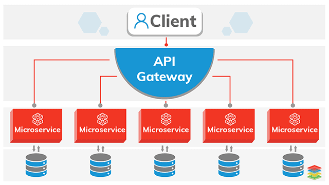
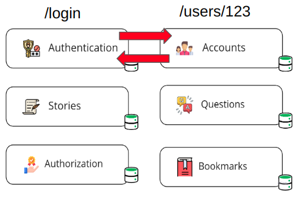
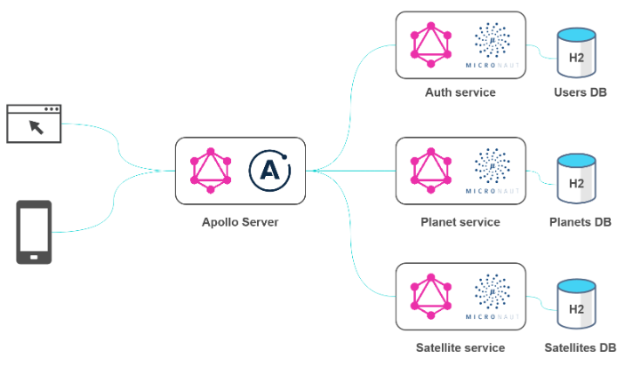
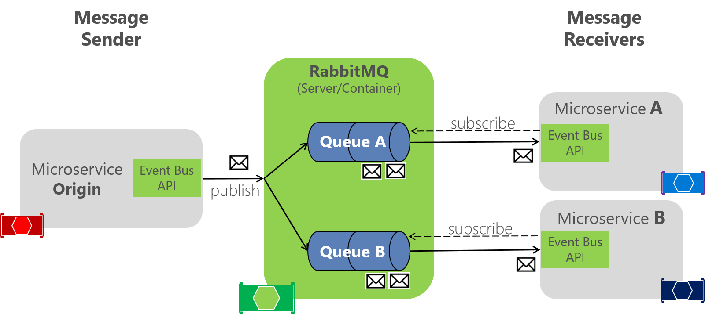

1. ### Microservice là gì?

   Microservice là 1 kiểu kiến trúc phần mềm. Các module trong phần mềm được chia thành các service nhỏ.
   Mỗi service đều có 1 logic riêng và có thể được deploy riêng biệt

   

2. ### Đặc điểm của microservice?

   1. Tập hợp 1 nhóm nhỏ các service: Mỗi service này sẽ chịu trách nhiệm cụ thể(single responsiblity)
   và chỉ tập trung vào nhiệm vụ đó
   2. Phát triển và mở rộng: Phát triển và mở rộng 1 service hoàn toàn độc lập. Mang lại tính linh hoạt
   của hệ thống. Quá trình deliver feature, release version sẽ dễ dàng và nhanh chóng
   3. Công nghệ: Giảm tải mối quan ngại về công nghệ sử dụng. Các service giao tiếp với nhau qua API,
   mỗi service có thể dùng một ngôn ngữ riêng biệt
   4. Tính độc lập: Đem lại tính độc lập và tự quản lí cho team, làm việc trong context riêng biệt, có 
   thể  tự quản lí

3. ### Các thuộc tính của microservice

   1. **Autonomous(Tính tự trị)**: 1 service là 1 đơn vị chức năng, cung cấp API để  thực hiện trao đổi, giao
   tiếp với các service khác
   2. **Isolated(Tính biệt lập)**: 1 service là 1 đơn vị triển khai, có thể  chỉnh sửa, test, deployed mà ko 
   ảnh hưởng đến khía cạnh khác
   3. **Elastic**: 1 service là phi trạng thái(stateless), có thể scale tùy ý khi cần thiết
   4. **Resilient**: 1 microservice sẽ được thiết kế để nhận các lỗi
   5. **Responsive**: Respond cho các request trong khoảng thời gian hợp lý
   6. **Intelligent**: Có thể tìm thấy các endpoint của microservice đã được đăng ký
   7. **Message Oriented**: Mô hình micro-service hoạt động dựa trên giao thức HTTP hoặc message bus để tạo nên 
   sự giao tiếp giữa các service. Điều này đảm bảo tính loose coupling, tính biệt lập và có thể cung cấp lỗi dưới 
   dạng message
   8. **Programmable**: Cung cấp API's cho phép truy cập bởi developer và administrator.
   9. **Composable**: Bao gồm nhiều microservices.
   10. **Automated**:  Lifecycle của Microservice được quản lý thông qua automation bao gồm (development, build, test, 
   staging, production và distribution.)

4. ### Ưu và Nhược điểm
    **Ưu điểm**
      1. Dễ nâng cấp và scale
      2. Tách biệt nên nếu một service bị lỗi, toàn bộ hệ thống vẫn hoạt động bình thường
      3. Có thể thoải mái sử dụng ngôn ngữ lập trình riêng, database riêng
      4. Khả năng testing dễ dàng hơn
      5. Cải thiện khả năng bảo trì
      6. Dễ dàng hơn trong việc tích hợp 3rd-party
      7. Mỗi service có dung lượng lưu trữ riêng và có thể có cơ sở dữ liệu riêng.

    **Nhược điểm**
      1. Có thể tốc độ không cao bằng monolith, vấn đề về bảo mật, transaction, lỗi kết nối, quản lý log files.
      2. Mỗi service sử dụng một database riêng, việc đảm bảo tính đồng nhất trong dữ liệu sẽ trở nên phức tạp
      3. Sử dụng nhiều service nên việc theo dõi, quản lý các service này sẽ phức tạp hơn.
      4. Software Architect để phân tách module, Techinical Leader để setup workflow, IT/DevOps để setup CI/CD , deploy lên cloud….

5. ### Vấn đề trao đổi dữ liệu giữa các service trong microservice
   Việc sinh ra rất nhiều các service con trong một hệ thống khiến lưu lượng mạng sẽ tăng lên gấp nhiều lần khi các service sẽ cần
   gọi lẫn nhau và chúng ta cần có các giải pháp để giảm lưu lượng mạng xuống mà vẫn đáp ứng được yêu cầu dữ liệu.
   
   **Dùng Service Mesh**
   
   **Dùng RESTful**

    

     1. Về REST thì bản chất vẫn là HTTP + JSON payload.
     2. Mỗi service sẽ có bộ API của riêng nó
     3. Một service gửi HTTP request đi và chờ HTTP response trở về
     4. Hình thức communication này còn được gọi là => Synchronous communication, tức thằng gửi request đi phải chờ
     có phản hồi thì mới xử lý tiếp.
     5. Hình thức communication này thì đơn giản và dễ dàng triển khai.
   
   **Dùng GraphQL**
    
    

     Tương tự như REST, GraphQL bản chất vẫn là HTTP + JSON. Tuy nhiên một chút điểm khác biết đó là client:
     1. Chỉ sử dụng POST method
     2. Client + Server đều dùng chung một Schema về resource - được quy định từ trước khi code
     3. Trả về đúng các thông tin về resource được yêu cầu, không thừa, không thiếu một field nào
     4. Single endpoint: Client chỉ gửi request tới một endpoint URL duy nhất
    
   **Dùng Message broker**

    

     Một cách khác để communicate giữa các service đó là dùng giao thức Message Broker, rất hữu ích với các service implenment event bus (Event Driven architecture):
     1. Trước tiên, các service (thường gọi là producer) sẽ gửi message đến một thành phần trung gian gọi là Broker, VD: Redis, RabbitMQ...
     2. Sau đó, broker sẽ đưa message vào trong queue để chờ tới lượt
     3. Khi tới lượt, message trong queue sẽ được gửi tới các subscriber (thường gọi là consumer) - chính là các service đầu cuối
     4. Đây là một dạng Asynchronous communication
     5. Trao đổi thông tin dưới dạng các message
     6. Ngoài ra, nó cũng hay được biết đến với pattern: Publish / Subscribe

   **Dùng gRPC**
   
   **Mixed - Kết hợp**